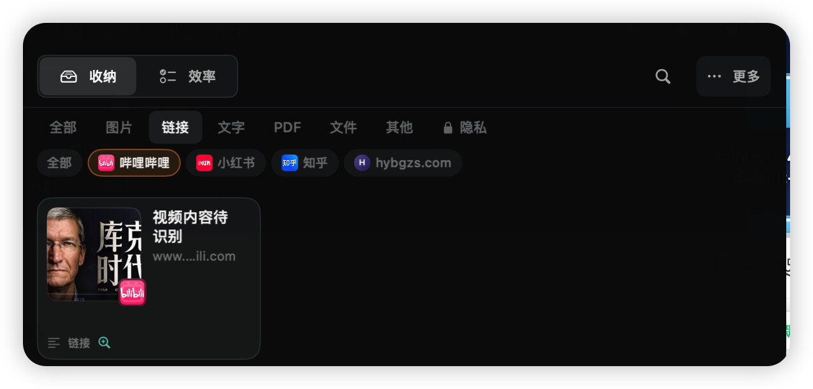
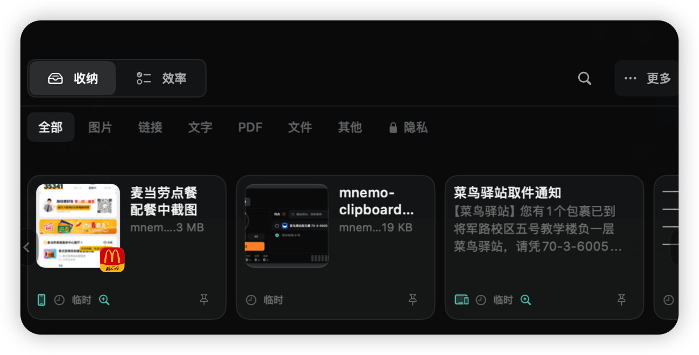
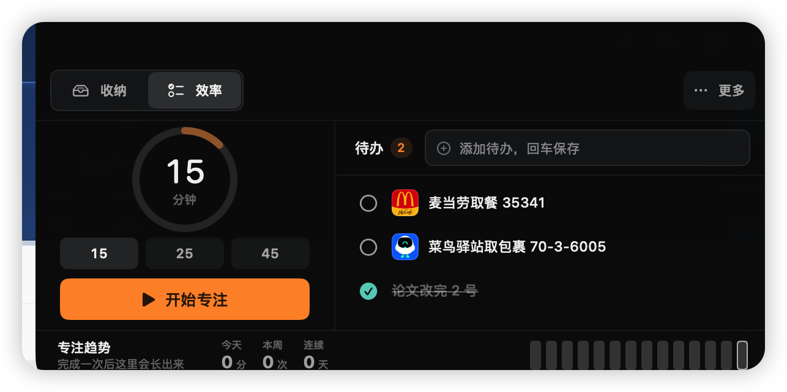

<p align="center">
  
</p>

<h1 align="center">Mnemo</h1>

<p align="center">
  Toss anything into your MacBook's notch. When you need it back, just ask.
</p>

<p align="center">
  
  
  
  
</p>

<p align="center">
  <a href="README.md">中文</a> ·
  <a href="#highlights">Highlights</a> ·
  <a href="#usage">Usage</a> ·
  <a href="https://github.com/huaxx-lab/mnemo/releases">Download</a> ·
  <a href="#build-from-source">Build</a>
</p>

<p align="center">⭐ If Mnemo is useful to you, a star means a lot.</p>

---





## Highlights

- **Just drop it on the notch.** Links, screenshots, PDFs, Word docs, chat messages — drag them to the top of the screen and they're stashed. Anything you copy lands in a temporary lane too.
- **Your iPhone's clipboard shows up on your Mac.** Copy text or a screenshot on your phone, and it's already waiting in the notch. Nothing to set up, nothing to press.
- **Ask for things the way you'd ask a person.** "Where's my Aliyun API key?" "The latest version of that RDMA paper" — type it into the search box and get the answer along with the file it came from. Everything you stash is read first: screenshots get OCR'd, PDFs and Office docs get their full text indexed, links fetch their page content.
- **⌘G answers in place.** Select text in any app and hit ⌘G. It answers using your library — and if your cursor is sitting in a text field, the answer streams in right there, character by character. No window switching.
- **Todos recognize themselves.** Pickup codes, package codes, schedule notices in chat screenshots — they turn into reminders on their own, and fire in the notch when it's time.
- **Versions of the same file stack themselves.** Even when the filenames look nothing alike, revisions of one document fold into a single accordion card, newest first.
- **Links know their platform.** Bilibili, Xiaohongshu, Zhihu and friends get proper icons — opens in the native app if you have it, otherwise in the browser you dragged it from.
- **A private space behind your fingerprint.** Hidden items freeze out of search until you unlock.
- **It updates itself.** Click the version number in the menu bar to check; one click downloads, installs, and relaunches.

## Usage

| Action | Result |
|---|---|
| Drag to the notch | Stash it |
| Hover or click the notch | Expand / collapse (your choice in Settings) |
| `⌃⌘N` | Expand / collapse |
| `⌃⌘V` | Stash the current clipboard |
| `⌃⌘C` | Capture the current selection |
| `⌘G` | Ask about the selection; answer lands in the notch or streams into your text field |
| Double-click a card | Preview (Office files open in their default app) |
| Single-click a card | Copy |
| Right-click a card | Rename, tag, move to private space, and more |

Every shortcut is remappable in Settings.

## Install

Grab `Mnemo-x.x.dmg` from [Releases](https://github.com/huaxx-lab/mnemo/releases) and drop it into Applications. On first launch, right-click → Open (it's a self-signed build, so macOS asks once).

## Build from source

```bash
swift build -c release   # requires the Xcode 26 beta toolchain
./scripts/build-app.sh   # produces build/Mnemo.app
swift test               # 300+ tests
```

---

<p align="center">Questions and ideas are welcome in <a href="https://github.com/huaxx-lab/mnemo/issues">Issues</a>.</p>
