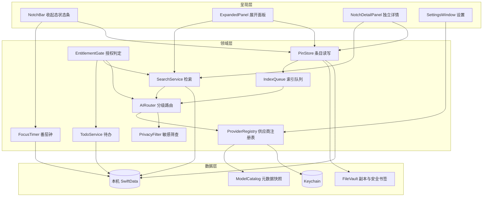
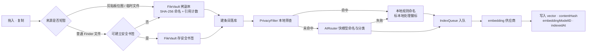
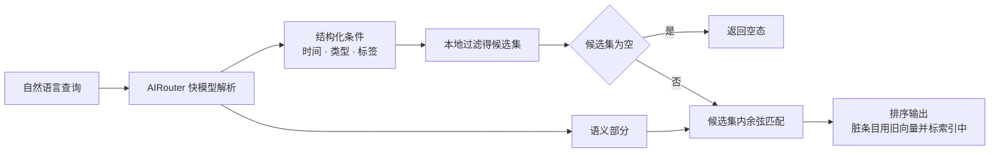

# Design：Mnemo 新版本

## 1. 架构总览

### 1.1 分层与模块依赖

三层。呈现层只读领域层暴露的状态，不直接触碰存储；领域层不感知任何具体供应商，只面向 `ProviderRegistry` 的抽象；数据层不含业务判断。

`EntitlementGate` 横切在领域层入口而非呈现层，保证将来加付费墙时不需要改动任何界面代码。

### 1.2 入库数据流

存储决策先于 AI，AI 失败不影响条目已经落库——这是「先存下来」这个产品承诺的技术保证。

### 1.3 检索数据流

结构化条件在本地执行、语义部分才动向量，是成本与准确率的双重优化：时间和类型这类硬条件用模型判断既贵又不可靠。

---

## 2. 模块 1：刘海交互与视觉

### 2.1 选型对比：融合动效实现

| 方案 | 原理 | 优点 | 缺点 | 选择 |
|------|------|------|------|------|
| 稳定分窗 + 刘海左右翼反馈 | 锚点、拖拽接收、工作台与详情分离；SwiftUI 显式阶段负责过渡；拖拽状态只在刘海左右翼呈现 | 点击与拖拽职责稳定；没有额外可见面板遮挡 | 需要窗口协调器与显式状态机 | ✅ |
| 所有内容都放进 `GlassEffectContainer` | 外壳与卡片均使用玻璃 | API 最少 | glass-on-glass 降低文字与缩略图对比度，内容层级混乱 | ✗ |
| `Canvas` + `blur` + `alphaThreshold` 全量 metaball | 模糊后按 alpha 阈值化，相邻圆形边缘粘连 | 形状自由 | 每帧重绘面积大；会替代原生玻璃材质；辅助功能全部要自己处理 | ✗ |
| 纯 `matchedGeometryEffect` | 视图几何插值 | 实现最简 | 只做形变不做材质融合，达不到「分离与融入」的观感 | ✗ |

**选用理由**：原方案让同一个 `NSPanel` 在收起、148pt 拖拽捕获与完整工作台之间缩放，同时 SwiftUI 又切换子树并执行弹簧动画，窗口几何与内容时序无法稳定同步。新方案让锚点、投放反馈、工作台和详情各自保持固定 frame；AppKit 只负责显示与隐藏，SwiftUI 只在固定画布内执行显式阶段动画。玻璃仍只承担导航外壳，内容卡片保持稳定可读。拖拽反馈位于刘海左右翼，真实文件继续由系统拖拽会话传递；不绘制张力桥或独立大块反馈。

刘海几何与无刘海降级参考 [NotchKit](https://github.com/duongductrong/NotchKit)（MIT）、[NotchDrop](https://github.com/Lakr233/NotchDrop)（MIT）和 [OpenNook](https://github.com/twinkling-reality/opennook)（Apache-2.0 / MIT）；当前实现未复制上述项目源码。

### 2.2 选型对比：收起判定策略

| 方案 | 原理 | 优点 | 缺点 | 选择 |
|------|------|------|------|------|
| 移出即收 | 指针离开命中区立即收起 | 手感最轻快 | 指针斜向移往面板时会途经命中区外，触发误收；触控板用户高频踩中 | ✗ |
| 延迟宽限 + 悬停意图安全区 | hover 打开，离开后延迟并计算三角路径 | 看起来灵敏 | 菜单栏是高频路过区域，仍会意外展开；状态机和命中区复杂 | ✗ |
| 仅显式操作 | 点击或快捷键开合；点击外部 / Esc 关闭 | 行为完全可预测，不会路过即遮挡 | 多一次点击 | ✅ |

**选用理由**：刘海与菜单栏都位于指针高频经过的屏幕边缘，hover 展开会在用户并无取用意图时遮挡工作区。普通 hover 绝不改变窗口状态。点击由固定锚点窗口独占；148pt 拖拽接收层不承载 SwiftUI 工作台，也不负责普通点击。投放反馈只有在系统 pasteboard 类型通过校验后出现。已钉住可否决外部点击关闭；未保存编辑则在所有关闭入口统一进入二次确认。

锚点面板是 `nonactivatingPanel` 且永远不成为 key window，别的应用在前台时 SwiftUI `Button` 收不到第一次点击。所以收起态**所有**可点区域都由 `NotchAnchorHostingView` 按共享 metrics 命中并执行：展开唇、每一条推荐行、右翼的关闭；SwiftUI 只负责画。物理刘海没有像素，不能直接收事件，唯一展开区是其下方可见窄唇；`NotchAnchorHostingView.hitTest` 只拦截该矩形，其余交还 SwiftUI，因此推荐复制 / 关闭与展开各有一个所有者。`NotchAnchorLayoutMetrics` 同时投影 SwiftUI 尺寸、`NSPanel` frame、命中矩形与推荐行：0 条最小，1 条留翼，多条从物理刘海与展开唇下方开始。工作台出现时锚点完全 order out。

### 2.3 状态条优先级仲裁

收起态同一时刻只表达一个状态。多个状态并存时按固定优先级取最高，不做并列或轮播——刘海宽度不足以承载两个状态，轮播则让用户无法预期看到什么。优先级链定义为拖拽命中 > 计时中 > 索引或同步进行中 > 默认入口，实现上以一个有序枚举做比较，新增状态时只需插入枚举位置，不改仲裁逻辑。物理刘海中间不可显示内容，因此左翼放状态图标，右翼保留至少 86pt 给 `mm:ss`，窗口宽度必须包含左右翼，不能只按刘海宽度裁切。

### 2.4 双模式的状态建模

模式是一个持久化的单值枚举，作用域仅限展开态——收起态由状态条统一表达，不参与模式区分。切换同时提供滑动手势与可点击指示器：纯手势发现性太差，多数用户不会知道存在另一套界面；纯控件又要常驻占用刘海宽度。指示器只在展开态出现，收起态因此零占用。

模式状态与窗口状态分开存储。工作台窗口使用固定外框，模式切换只替换内部内容，不动画 AppKit frame。预览与文本编辑放进其下方的独立 `NotchDetailPanel`；两窗视觉分离但共享选中条目状态，避免详情内容挤进物理刘海或与卡片重叠。详情存活不依赖工作台 phase：预览和编辑详情都自带关闭键，刘海工作台收起后仍显示；编辑详情自己的关闭仍受未保存确认保护。

---

## 3. 模块 2：收纳与存储

### 3.1 选型对比：文件持有方式

| 方案 | 原理 | 优点 | 缺点 | 选择 |
|------|------|------|------|------|
| 全副本 | 一律拷贝进沙盒 | 永不断链；同步实现简单 | 大文件直接翻倍占盘，且用户对沙盒占用零感知 | ✗ |
| 全引用 | 只存安全书签 | 零额外占用，与访达实时一致 | 临时图片和剪贴板位图会在入库后消失 | ✗ |
| 阈值混合 | 小于阈值拷副本，否则存书签 | 旧版本行为稳定 | 文件大小不能表达来源是否稳定；小文件也会无感重复占盘 | 仅兼容 |
| 引用优先 + 临时来源副本 | 普通文件建安全书签；仅短暂来源或书签失败时副本 | 符合“能链接就链接”；磁盘占用可预测 | 需要区分删除、卷离线和内容变化 | ✅ |

**选用理由**：最新规则是“能链接就链接，实在不能再副本”，所以决策依据必须是来源稳定性而不是体积。普通文件保存安全书签；剪贴板位图和系统临时文件显式要求副本。引用健康检查把 `sourceDeleted`、`temporarilyUnavailable` 与 `contentChanged` 分开：删除进入回收站，外置卷离线冻结，内容变化只重建索引。旧阈值路径只作为迁移与兼容测试保留，不再由新 UI 调用。

### 3.2 选型对比：副本标识

| 方案 | 原理 | 优点 | 缺点 | 选择 |
|------|------|------|------|------|
| 保留原文件名 | 直接沿用 | 目录可读 | 同名冲突需加后缀；无法识别重复内容 | ✗ |
| UUID | 随机生成 | 无冲突 | 同一文件多次 Pin 会存多份 | ✗ |
| 内容 SHA-256 | 以内容哈希命名 | 天然去重；可校验副本完整性 | 入库时多一次全文件哈希的 IO | ✅ |

**选用理由**：哈希成本只落在受管副本路径上；引用文件保持原位。换来的去重能力对剪贴板位图和临时文件仍是刚需，哈希同时充当完整性校验，对账扫描可以直接复用。

### 3.3 引用计数与回收站的生命周期

副本文件与条目是一对多。条目删除时递减引用计数，计数归零的副本不立即删除，而是随最后一个条目一起进入回收站——因为源文件可能早已不存在，此时副本是唯一一份，物理删除等同于永久丢失数据。回收站到期清理时才真正删盘。

回收站内的条目保留其向量。这是一个刻意的取舍：向量体积远小于副本文件，为省这点空间而在恢复时重算，既浪费用户的 token 又让恢复动作产生了不可预期的延迟。

### 3.4 存储用量的统计口径

活跃副本与回收站副本分别计数，因为用户对它们的处置意愿不同。缩略图当前只使用有界内存缓存，不作为持久磁盘用量类别。副本统计以清单中的引用关系为准而非每次打开设置都扫盘；启动对账负责发现清单与磁盘偏差。

### 3.5 文本编辑的保存语义

采用显式确认而非自动保存。刘海是一个随时可能失去焦点的容器，自动保存会在用户毫无察觉的情况下产生大量写入，也让「取消」这个动作失去意义——用户点开看一眼就移开鼠标，不应该被当作一次修改。

编辑态持有内容的临时副本，确认前不写库。因此编辑过程中崩溃或强退不会污染原内容，这也是不做自动保存后必须补上的安全网。

确认写回时以内容比对而非「是否打开过编辑器」决定是否标脏。用户打开编辑器又原样关闭是高频行为，若据此触发重算，会产生用户完全无法理解的 token 花费。这条与双键脏判定的设计意图一致：只有内容真的变了才重算。

### 3.6 剪贴板临时轨道与状态转换

剪贴板条目不是“永 Pin”，而是容量受控的临时轨道。监听器只在系统 `changeCount` 变化时读取一次，默认只保留最近 5 条未固定项；固定动作把条目从临时集合提升为普通 Pin，之后不参与容量淘汰。Mnemo 自己执行复制前记录写入标记，下一次监听命中该标记时直接消费，避免“点一次复制又新增一张卡”的回环。

临时 / 固定只影响保留策略，不影响 AI 资格。新内容仍使用统一的内容版本键进入整理与索引队列；重复剪贴板内容复用已有条目，淘汰只是进入回收站并冻结向量。这样再次遇到同一内容时可以恢复，而不是重复落盘和重复计费。

---

## 4. 模块 3：AI 供应商接入

### 4.1 选型对比：模型元数据来源

| 方案 | 原理 | 优点 | 缺点 | 选择 |
|------|------|------|------|------|
| 硬编码在 App 内 | 常量表 | 零依赖、零网络 | 任何一家调价或发新模型都要发版 | ✗ |
| models.dev `api.json` | 社区以 TOML 提交、CI 校验 schema 的开源数据库 | 单一端点覆盖供应商、baseURL、单价、上下文上限、输入模态、工具调用能力；MIT | 社区维护存在滞后 | ✅ 主源 |
| LiteLLM 价格表 | 以模型为主键的大型 JSON | 字段更细；部分条目带 `mode` 与 `output_vector_size` | 供应商与 baseURL 信息弱；官方 embedding 覆盖仍不完整 | 调研参考，不作为运行时依赖 |
| OpenRouter `/models` | 供应商自有目录的实时价格 | 价格实时 | 只覆盖其自有目录 | 作为供应商选项，非数据源 |

两份目录对 embedding 模型的覆盖都不足以依赖。因此 embedding 侧不设「目录即真相」的假设——模型名与输入单价允许手动输入，输出维度在首次调用时运行时探测并记录；语义成本只按手填价格和本机调用长度估算。

这个决定有一个额外收益：维度既然是探测得来而非预先声明的，维度不一致的检测就不需要任何外部数据支撑，比对记录值与实际返回长度即可。

**选用理由**：价格与模型列表是会持续漂移的外部事实，把它编译进二进制等于把发版节奏绑定在别人的定价公告上。models.dev 是唯一一个把「供应商配置」和「模型能力与价格」放在同一份结构里的开源数据源，能同时驱动配置界面、能力门控和成本预估三处，不需要拼接多份数据。其中 `modalities.input` 字段的价值高于价格本身——它让能力门控可以在用户点击之前就给出解释，而不是发出请求后报错。

### 4.2 元数据刷新策略

内置一份裁剪过的快照随包发布，保证首次启动与离线场景下配置界面完整可用。供应商官方 `/models` 列表与 models.dev chat 元数据是两条独立通道：首次切换供应商只读取一次官方列表并持久化标记，之后由用户点击刷新；models.dev 也只在用户点击「刷新能力与价格」时拉取，按同名模型补元数据。两条通道都不由启动、定时器或设置页出现触发；刷新失败保留旧对象，绝不清空后逐项回填。

裁剪规则是只保留常用供应商及其对话与向量模型，因为完整目录中绝大部分条目对 Mnemo 的使用场景没有意义，而包体积直接影响下载转化。

### 4.3 选型对比：凭据存储

| 方案 | 原理 | 优点 | 缺点 | 选择 |
|------|------|------|------|------|
| Keychain | 系统钥匙串 | 系统级加密；不随备份明文外泄；有访问控制 | 读写可能失败，需处理错误路径 | ✅ |
| UserDefaults | plist 明文 | 实现最简 | 明文落盘，任何进程可读；随备份外泄 | ✗ |
| 自加密文件 | 自行加解密 | 不依赖系统 API | 密钥本身仍需安全存放，问题只是被推迟 | ✗ |

**选用理由**：自加密方案无法回答「加密密钥存哪」这个问题，最终仍要落到 Keychain，中间层纯属多余。Keychain 读写失败时明确报错并禁用 AI 功能，不做任何降级到明文的回退——静默降级会让一个安全属性在用户不知情的情况下消失。

### 4.4 供应商配置模型

预设与自定义供应商在存储上是同一个实体，预设只是一个带默认值的初始态。这样用户可以直接修改预设的 baseURL 以适配企业代理或镜像站，而不必退回自定义流程重填一遍；也避免了维护两套配置结构及其迁移逻辑。

供应商之间的协议并不统一：部分走 OpenAI 兼容的 `/chat/completions`，部分走 Anthropic Messages（MiniMax 即属后者，其 baseURL 形如 `.../anthropic/v1`）。因此配置实体必须显式携带协议方言字段，由适配层按方言选择请求与响应的编解码路径。把「兼容 OpenAI」当作默认假设会在接入这类供应商时直接失败，且失败点远离配置界面、难以归因。

供应商图标随包内置而非运行时拉取。配置界面是用户第一次接触 AI 功能的地方，让它依赖网络会在最差的时机产生最差的第一印象。

---

## 5. 模块 4：AI 能力

### 5.1 查询解析的两段式设计

自然语言查询在输入阶段先由本地规则拆出常见时间与类型，提供零网络的即时筛选；用户按回车主动提交后，快模型再补充复杂结构化条件与语义部分，并只在这时计算查询向量。这样设计有三个理由：半成品输入不应持续计费；先用结构化条件收窄候选集能显著降低相似度计算规模；解析结果对用户可见，用户能看懂「系统理解成了什么」并直接修正，而端到端的黑盒检索出错时无从纠正。相同查询与路由在运行期缓存，回车、按钮和焦点变化不会叠加重复请求。

解析失败时降级为纯全文匹配，而不是放弃搜索。

### 5.2 选型对比：语义检索实现

| 方案 | 原理 | 优点 | 缺点 | 选择 |
|------|------|------|------|------|
| 交给对话模型挑选 | 把候选清单塞进上下文让模型返回 ID | 任何供应商都能跑，无需 embedding 接口 | token 成本随库规模线性上涨；每次搜索都有秒级延迟 | ✗ |
| embedding + 本地余弦 | 入库时算向量，检索时本地比对 | 成本一次性；检索无网络往返 | 需单独配置支持 embedding 的供应商 | ✅ |
| 仅关键词匹配 | 全文倒排 | 零成本 | 搜不出「跟报销有关的」这类模糊意图 | ✗ |

另有一个配置层面的现实约束：部分主流对话供应商完全不提供向量接口（MiniMax 即是其一，其目录下没有任何 embedding 模型）。这不是「同一 key 换个模型名」能绕开的，用户必须配置第二家供应商。因此配置界面要把这件事讲清楚，而不是让用户在下拉框里反复找一个不存在的选项。

**选用理由**：搜索是高频动作，把成本和延迟都压在每一次查询上不可接受，而 embedding 把成本移到了低频的入库时刻。代价是必须单独配置 embedding 供应商——Anthropic、月之暗面等主流对话供应商不提供向量接口，因此 chat 与 embedding 在配置模型上必须解耦，不能假设一个 key 通吃。未配置时语义搜索入口不可用并说明原因，结构化搜索不受影响。

### 5.3 敏感筛查的判定方式

判定完全在本地以规则完成：身份证号走 GB 11643 校验码、银行卡号走 Luhn 校验、其余按正则与关键词特征。采用带校验位的判定而非纯位数正则，是为了压低误报——误报的代价是用户莫名其妙失去 AI 能力，比漏报更容易被感知为「这软件坏了」。

不使用模型判断敏感性：判断本身就要把内容发出去，与筛查目的自相矛盾。规则方案的局限是无法覆盖语义层面的敏感（如一段没有数字特征的商业机密），因此提供逐条的显式覆盖入口，把最终判断权交回用户，而不是假装拦得住。

### 5.4 分级路由的分配依据

按任务的上下文长度与输出结构要求分配，而非按重要性。命名、分类、查询解析与场景识别是短输入、短输出、结构固定的任务；PDF 问答与粘贴加工是长上下文、开放输出的任务。路由先解析全局快/强默认值，再叠加每功能的供应商、模型与思考强度覆盖。适配层按模型能力决定是否编码思考参数，不能把某一家方言的字段盲传给所有供应商。

### 5.5 详情动作与剪贴板上下文推荐

详情动作只服务当前 Pin 的复制、预览、OCR 与问答。顶部推荐由**外部剪贴板事件**驱动：粗筛 → 本地意图 → 可选布尔路由 → 查询 Embedding 与本地分块召回 → 候选内 LLM 收敛。主动搜索和快捷路径共享 `ContentChunk` / 向量索引；`allowsNetwork` 只控制查询理解，`usesEmbedding` 独立控制查询向量，所以快捷路径可保持本地确定性解析而不丢失语义召回。

模型结果语义明确：有效 `selected([ID])` 以白名单为最终集合；有效 `selected([])` 清空初步卡片；`malformed` 保留本地搜索结果并提示。剪贴板重排另有 `unavailable`，只有此时才回退到类型匹配且 `hasLocalEvidence` 为真的候选。模型不能发明 ID，也不能授权自动复制。

自动复制接受两类资格：本地唯一（字段值、精确标识、全活动库某类型唯一），或模型在候选内恰好收敛到一条且该条真的被本地检索命中（`hasLocalEvidence`，补位候选不算）；不再附加"命中本地词表点名的类型"这一条——由模型判定为检索的请求本地意图本来就是空的；敏感字段两条都不放行，模型返回多条时只推荐。文件异步解析 URL 后再次检查 context generation，系统粘贴板写入成功才发布对号。新事件、关闭与取消都会递增 generation，旧任务不能覆盖新剪贴板。图片在 Vision OCR 分块原子落库后进入同一管线。判据分两层。类型词表只有一份（`ContentTypeVocabulary`），剪贴板意图解析与搜索查询解析共用：两份词表各自维护时，给一边补了"的图"另一边不认，检索就没有类型过滤，一条正好含关键词的文字会把要找的图挤掉。剪贴板判定出的类型会传进检索，但**只作偏好、不作墙**：类型是从一个词猜出来的，"我要终端使用指南"里的"指南"会判成 PDF/文件，这份指南要是存成文字或链接，带类型的召回就是空集，于是推荐什么都不给，而搜索页没有这道过滤照样找得到——这正是"搜索行、复制推荐不行"的来源。带类型先试，滤空了退回不限类型再试一次；候选补位也先补同类型、再补其余，不让某一类被永久挡在模型视野之外。

被动剪贴板不再触发推荐。它只决定内容是否进入最近五条：本地确信是查询时不入库；本地认不出但形态像短诉求时调用 `isRetrievalQuery`，仅回答去留。没有路由、请求失败、格式异常或不确定都按 false 处理，保留用户内容。Mnemo 自写的每个 `changeCount` 都被忽略。

⌘G 才进入推荐链。它读取前台选区，代按 Cmd-C 登记成自写，不制造 Pin。`ContextRetrievalGate` 的形态 / 证据门对主动触发让路，然后共享查询 Embedding 与本地分块召回。控制器用跨文档、图片、网页、表格、日志、代码和普通文字的成对 Few-shot 按“最终产物”分类；结构化输出含互斥的 `intent: retrieve | answer` 和候选白名单 ID：

1. **retrieve**：交付真实文件 / 图片 / Pin；局部网址、单号、名字只能由模型指认，且必须经 `CopyPayloadResolver` 在完整本地内容中逐字验证。
2. **answer**：控制器 ID 仅是内部证据，不显示原对象卡；重新从 `Library.chunks(for:)` 读取分块；长页围绕查询命中取 2,400 字窗口，而不是复用 180 字候选摘要；独立回答步骤强制输出完整简体中文；generation 校验后按交付策略输出：默认在按键时捕获外部可编辑宿主并通过 SSE 分段写入；原生输入框走 AXSelectedText / AXValue，微信、Electron 与网页自绘输入框从 AXEditableAncestor 解析宿主，AX 拒绝写入时改用定向 Unicode 键盘事件且不碰剪贴板。无输入框、开关关闭、密码 / 只读 / 自身控件或焦点及按键后的光标 / 选区改变时退回剪贴板。模型截断或网络中断时，在光标仍匹配的前提下撤回本轮已插入半成品。写成功才显示对应的“已写进输入框 / 已放进剪贴板”，失败保留明确状态与手动复制。回答卡无叉号、点外部收起；正文无描边并严格裁剪在标题下方，自绘细滑块悬浮右边界且无滚动槽。Command-G 每次按键生成新 capture token，精确登记真实 changeCount；连续触发不按频率拒绝，只以 latest-wins 取消旧抓取；旧轮已经流入输入框的半截在光标仍匹配时安全撤回。缓存重放重新进入处理中状态。 选区来源按 AXSelectedText → Command-C 新写入 → 外部应用自动复制基线 → 同一前台应用显式选区记忆降级；最后一层无 TTL，只供主动 Command-G，Mnemo 自写回答不能进入。
3. **轮次隔离**：controller 与 answer 每次都构造新的 system/user 消息；不保存 message history 或跨轮 tool state。最终决策缓存只避免相同请求重复计费，不进入下一轮 prompt。
4. **完整性**：OpenAI `finish_reason=length` 与 Anthropic `stop_reason=max_tokens` 都标记为截断，用户只看到明确失败，不发布半句。

### 5.6 AI 调用时机、流式渲染与恢复

AI 的触发键是“功能 + 内容版本 + 路由”，不是界面生命周期。搜索与上下文分别使用 generation token；新请求取消旧任务，流式事件、50ms 节流发布、最终卡片和错误都必须属于当前 generation。SSE 解析器跨任意网络分块复原 OpenAI / Anthropic 增量与 `[DONE]`；`---PINS---` 前是回答，后是候选 JSON。Markdown 按稳定块增量解析，已收尾的标题、列表、代码块和段落保持 identity，不随每个 token 重建。

整理与索引队列分别持久化并串行执行。同一内容版本不重复入队；网络恢复只唤醒一次；401、缺失 Key 和无效配置等待配置变化，429 才按 `Retry-After` 与指数退避。

## 6. 模块 5：向量索引## 6. 模块 5：向量索引

### 6.1 选型对比：向量存储

| 方案 | 原理 | 优点 | 缺点 | 选择 |
|------|------|------|------|------|
| SwiftData blob + 内存暴力余弦 | 向量随条目存为二进制，检索时全量点积 | 零额外依赖；与条目同生命周期，删除天然级联 | 条目量级上万后内存与耗时上升 | ✅ |
| sqlite-vec | SQLite 扩展，支持近似最近邻 | 支持大规模检索 | 引入 C 依赖与构建复杂度；当前量级用不上 ANN | ✗ |
| 外部向量服务 | 托管向量库 | 无规模上限 | 与零服务器成本、数据不出机器的前提直接冲突 | ✗ |

**选用理由**：单条向量体积为维度乘以四字节，实际库体积 `[运行后填入]`。产品形态是人工挑选的长期收藏夹，条目规模由人的整理意愿而非机器采集决定，暴力点积在这个量级上远未成为瓶颈。引入向量数据库会带来构建、迁移、损坏恢复三类新的失败模式，而它们要解决的规模问题目前并不存在。等真实数据显示瓶颈出现再替换，届时接口不变、只换实现。

向量与条目同表存储还带来一个额外好处：删除条目时向量随之消失，不存在需要单独维护的级联删除路径，也就不会产生孤儿向量。

### 6.2 脏判定与一致性

以 `contentHash` 与 `embeddingModelID` 两个键共同判定脏：前者捕捉内容变化，后者捕捉模型变更。两者任一不匹配即入队重算。用双键而非单一时间戳，是因为时间戳无法区分「内容真的变了」和「只是被重新保存了一次」，会造成大量无谓的重算与花费。

重算期间条目仍持有旧向量并正常参与检索，只在结果中标注状态。若改为把重算中的条目排除出结果，用户会看到搜索结果无故减少，且完全无法理解原因——这比返回一个略微过时的匹配糟糕得多。

队列持久化到存储而非仅存内存，保证进程退出后可续跑。串行执行而非并发，是为了让失败重试的退避策略可预测，也避免在供应商侧触发限流。

---

## 7. 模块 6：效率模式

### 7.1 选型对比：待办建模

| 方案 | 原理 | 优点 | 缺点 | 选择 |
|------|------|------|------|------|
| 统一实体 + 可选 Pin 关联 | 待办是一等实体，可关联零个或一个条目 | 一套存储、一套同步、一套搜索；Pin 可直接转待办 | 需处理关联条目被删除时的悬挂引用 | ✅ |
| 两套独立实体 | 待办与条目互不相干 | 职责边界清晰 | 同步、搜索、回收站逻辑全部要写两遍 | ✗ |
| 待办降级为条目上的标记 | 仅一个布尔字段加截止日期 | 实现最轻 | 无法表达与任何条目都无关的纯待办 | ✗ |

**选用理由**：产品上待办与收纳同源——被 Pin 下来的链接、PDF 本身常常就是一件待办，两者共享数据源才能实现「Pin 一下顺手勾个待办」这个连贯动作。选统一实体而非条目标记，是因为纯文字待办必须能存在；关联条目被删除时待办降级为纯文字待办并保留标题，不连带删除。

### 7.2 番茄钟的计时基准

以开始时刻的绝对时间戳为基准，剩余时间由当前时间推算，而非累加定时器 tick。系统休眠、App 挂起、定时器被节流都会让 tick 累加严重偏离真实时间，而用户对「专注了多久」的判断来自墙上时钟。

---

## 8. 模块 7：本地迁移与备份

Mnemo 已移除 iCloud / CloudKit，不声明云容器、不运行同步协调器，也不显示云同步设置。跨设备迁移使用 `.pinlandarchive`：导出条目、受管副本、标签、分组、待办与专注记录；导入先验证副本哈希，再写入。安全书签、向量与 Keychain 凭据不迁移，目标设备按本机配置重建索引。旧数据库的 `cloudSystemFields` 只作为兼容列保留且恒为 nil。

## 9. 模块 8：授权抽象层## 9. 模块 8：授权抽象层

所有未来可能付费的能力经由单一判定入口，本版本恒返回已解锁。把判定放在领域层入口而非各个界面，是为了保证加墙时改动集中在一处；把它现在就建立起来而不是将来再插入，是因为事后在散落各处的调用点补判定必然遗漏。

记录首次启动的版本号用于识别早期用户。该值只写一次，后续升级不覆盖。

---

## 10. 边界情况处理

下表每一行都是编码阶段的实现清单：进入编码时先按此表逐条落成显式校验或异常捕获并产生可观测输出，再写正常逻辑。静默吞掉异常会掩盖上游问题，本表不接受任何 silent fallback。

| 边界情况 | 检测方式 | 处理策略 |
|----------|----------|----------|
| 拖入空文件（零字节） | 入库前读取文件大小为 0 | 拒绝入库并提示文件为空，不创建条目 |
| 拖入的文件不存在或不可读 | 可读性检查与打开失败 | 拒绝入库，提示具体原因，记 warning |
| 拖入内容类型无法识别 | UTI 判定为空或未知 | 按通用二进制文件入库，禁用预览与 AI 能力，不拒收 |
| 剩余磁盘空间不足以拷贝副本 | `.copyRequired` 写入前比对可用空间与文件体积 | 明确失败并清理暂存文件；不偷换为会很快失效的引用 |
| 副本拷贝中途失败 | 拷贝抛出 IO 错误 | 回滚已写入的部分文件，条目不落库，向用户报错，不留半份副本 |
| 引用源确认删除 | 父卷在线且文件不存在 | Pin 自动进回收站，旧向量冻结；再次拖入同内容恢复原 ID |
| 拖入的是别的应用容器 / 缓存里的文件 | `DroppedSourceTrust.requiresManagedCopy` | 强制走受管副本，不存书签——那条路径归对方管、随时被清，且受 TCC 保护读不到 |
| 直接给的文件路径读不出字节 | 实际打开读 1 字节，而非只看权限位 | 优先改走发送方的文件承诺；仍不可读则明确失败，不把读不到的路径放上剪贴板 |
| 引用源暂时不可用 | 外置卷未挂载或权限暂不可得 | 保留 Pin，不误删、不重试 AI，待来源恢复后继续 |
| 引用源内容变化 | 当前内容版本与记录不一致 | 标脏并串行重建索引；索引字段回填不触发新的内容处理任务 |
| 数据库有记录但副本文件缺失 | 启动时双向对账扫描 | 条目转损坏态并提示，不自动删除记录 |
| 磁盘存在副本但数据库无记录 | 启动时双向对账扫描 | 删除孤儿文件并记 warning |
| 引用计数归零后删除副本失败 | 删除抛错 | 保留零计数记录待下次启动重试，不吞异常 |
| 回收站清理时目标文件已被外部删除 | 文件不存在 | 视为已清理，仅清数据库记录，继续处理本轮其余条目 |
| 未配置任何 AI 供应商 | 注册表为空 | AI 入口置灰并说明；命名回退本地规则；不弹错误 |
| API key 无效 | HTTP 401 | 明确提示密钥无效，不重试，暂停该供应商的队列任务 |
| 供应商限流 | HTTP 429 与 `Retry-After` | 指数退避重试，任务留在队列，界面显示排队中 |
| 请求超时或网络不可达 | 超时与网络错误码 | 任务留在队列等待恢复，不丢任务，不弹打断式弹窗 |
| 模型返回非法 JSON 或结构不符 | 解码失败 | 重试一次；仍失败则回退本地规则命名并记 warning，不留空标题 |
| 模型返回标题为空或超长 | 长度校验 | 为空则回退本地规则；超长按上限截断 |
| 待处理内容超出模型上下文上限 | 送出前按目录中的上下文上限预估 | 截断并标注基于部分内容生成，不直接失败 |
| 所选模型不支持所需输入模态 | 查目录的输入模态字段 | 入口置灰并说明原因，禁止发起请求 |
| 内容命中敏感规则 | 本地校验位与正则匹配 | 不外发，回退本地命名，标本地处理徽标 |
| 敏感规则误报 | 用户主动申诉路径 | 提供逐条显式覆盖入口，覆盖决定持久化到该条目 |
| 未配置 embedding 供应商 | 配置为空 | 语义搜索入口不可用并说明；结构化与全文搜索不受影响 |
| embedding 返回维度与已记录维度不一致 | 实际返回向量长度与首次探测记录值比对 | 判定为模型变更，更新记录维度并触发全库标脏重算，不做跨维度混算 |
| 首次探测 embedding 维度时请求失败 | 探测请求抛错 | 不写入维度记录，该供应商标记为未验证，语义搜索入口保持不可用并说明原因 |
| 候选集为空时执行相似度计算 | 集合为空判断 | 直接返回空态，不对空集合求极值 |
| 向量模长为零导致余弦除零 | 计算前检查模长 | 该条相似度记为 0 并记 warning，不产生 NaN |
| 索引重算中进程退出 | 启动时检查持久化队列中的未完成任务 | 从断点续跑 |
| 元数据刷新失败或返回非法 JSON | 请求失败或解码失败 | 静默回退内置快照并记 warning，不阻塞启动与任何功能 |
| Keychain 读写失败 | 系统 API 返回错误码 | 明确提示并禁用 AI 功能，禁止降级为明文存储 |
| 番茄钟运行中系统休眠 | 唤醒后比对开始时间戳 | 按真实经过时间结算，不按定时器累加 |
| 多个状态条状态同时满足 | 有序枚举比较 | 取优先级最高者，不并列不轮播 |
| 运行设备无刘海或外接显示器为主屏 | 屏幕配置变更通知 | 回退为主屏顶部居中的点击式状态控制，不以 hover 自动悬浮展开 |
